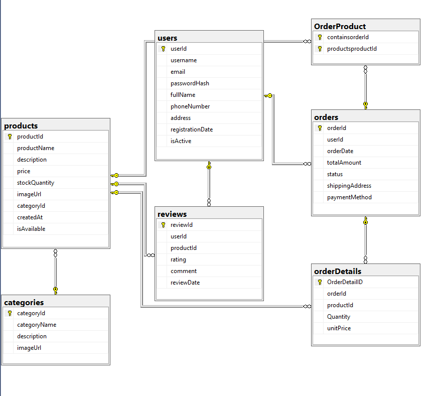

# 🛒 E-Commerce System – ERD & Models
+-----------------------------------------+
|        E-Commerce Database Design       |
|      Entity Framework Core Project      |
+-----------------------------------------+


A database modeling project for an **E-Commerce System** that demonstrates the design and implementation of entities, relationships, and **Entity Framework Core** models following relational database principles.

---

# 📌 Overview

This project focuses on designing the core database structure of an **E-Commerce System** using **Entity Framework Core** and **SQL Server**.

It includes entity models, relationships, validation attributes, and database configuration required to build a scalable e-commerce application while following database design best practices.

---

# 🚀 Features

- 🛍️ Product Management
- 📂 Category Management
- 👤 Customer Management
- 📦 Order Management
- ⭐ Product Reviews
- 🔗 Entity Relationships
- ✔️ Data Annotations & Validation
- 💾 SQL Server Integration
- ⚡ Entity Framework Core

---

# 📂 Project Structure

```text
E-Commerce-System
│
├── Models
├── Data
├── Migrations
├── DbContext
└── Program.cs
```

---

# 🏗️ Architecture

The project follows a **relational database design** where entities are connected using **One-to-Many relationships**.

Entity Framework Core is used to map models, configure relationships, and manage SQL Server database operations efficiently.

---

# 🗄️ Database Design

## Entity Relationship Diagram (ERD)



---

# 📊 Database Entities

| Entity | Description |
|---------|-------------|
| User | Stores customer information |
| Category | Organizes products into categories |
| Product | Stores product details |
| Order | Represents customer orders |
| OrderDetail | Stores ordered products |
| Review | Stores customer reviews and ratings |

---

# 🔗 Relationships

- One Category → Many Products
- One User → Many Orders
- One Order → Many Order Details
- One Product → Many Order Details
- One User → Many Reviews
- One Product → Many Reviews

---

# 🎯 Highlights

- ✅ Relational Database Design
- ✅ Entity Framework Core Models
- ✅ Primary & Foreign Keys
- ✅ One-to-Many Relationships
- ✅ Data Validation
- ✅ Clean Model Structure

---

# 🛠️ Technologies

- C#
- .NET
- Entity Framework Core
- SQL Server
- LINQ

---

# ⚙️ Getting Started

```bash
git clone https://github.com/Anoudalsaidi/E-Commerce-System-ERD-Models.git

cd E-Commerce-System-ERD-Models

dotnet restore

dotnet ef database update

dotnet run
```

---

# 📚 What I Learned

- Designing relational databases
- Implementing Entity Framework Core models
- Creating entity relationships
- Using Data Annotations for validation
- Working with SQL Server
- Building scalable database structures

---

# 🚀 Future Improvements

- ASP.NET Core Web API
- JWT Authentication
- Repository Pattern
- Clean Architecture
- Unit Testing
- Swagger Documentation
- Docker Support
- GitHub Actions (CI/CD)

---

# 👩‍💻 Author

**Anoud Alsaidi**

Backend Developer | .NET | Entity Framework Core | SQL Server

- **GitHub:** https://github.com/Anoudalsaidi
- **LinkedIn:** https://www.linkedin.com/in/anoud-alsaidi

---

⭐ If you found this project helpful, consider giving it a **Star** on GitHub.
